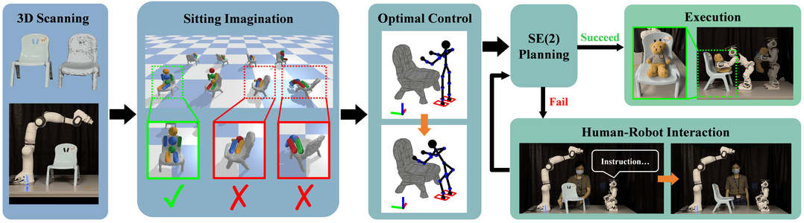

# Put the Bear on the Chair!

## Author
[Hongtao Wu](https://hongtaowu67.github.io), Xin Meng, [Sipu Ruan](https://ruansp.github.io), [Gregory Chirikjian](https://www.eng.nus.edu.sg/me/staff/chirikjian-gregory-s/)

National University of Singapore, Johns Hopkins University

## Abstract
In this letter, we study the problem of autonomously placing a teddy bear on a previously unseen chair for sitting. To achieve this goal, we present a novel method for robots to imagine the sitting pose of the bear by physically simulating a virtual humanoid agent sitting on the chair. We also develop a framework which leverages motion planning to plan SE(2) motions for a humanoid robot to walk to the chair and whole-body motions to put the bear on it, respectively. Furthermore, to cope with the cases where the chair is not in an accessible pose for placing the bear, a human-robot interaction (HRI) framework is introduced in which a human follows language instructions given by the robot to rotate the chair and help make the chair accessible. We implement our method with a robot arm and a humanoid robot. We calibrate the proposed system with 3 chairs and test on 12 previously unseen chairs extensively in both accessible and inaccessible poses. Results show that our method enables the robot to autonomously put the teddy bear on the 12 unseen chairs with a very high success rate. The HRI framework is also shown to be very effective in changing the accessibility of the chair.

## Links
- [Arxiv](https://arxiv.org/abs/2108.05539)
- [Video](https://youtu.be/HWcFx4XyktM)
- Code and data will be available

## Introductory Video
<iframe width="640" height="360" src="https://www.youtube.com/embed/HWcFx4XyktM" frameborder="0" allow="autoplay; encrypted-media" allowfullscreen></iframe>

## Supplementary Videos

### 1. Chair in Accessible Pose (Sky Blue Chair)
<iframe width="640" height="360" src="https://www.youtube.com/embed/WaNnRbhFApI" frameborder="0" allow="autoplay; encrypted-media" allowfullscreen></iframe>

### 2. Chair in Accessible Pose (Step Stool)
<iframe width="640" height="360" src="https://www.youtube.com/embed/2jnCZa_MO0E" frameborder="0" allow="autoplay; encrypted-media" allowfullscreen></iframe>

### 3. Chair in Inaccessible Pose + Human Obeys (Yellow Chair)
<iframe width="640" height="360" src="https://www.youtube.com/embed/MX8Aj8Bg5rs" frameborder="0" allow="autoplay; encrypted-media" allowfullscreen></iframe>

### 4. Chair in Inaccessible Pose + Human Obeys (White Blue Chair)
<iframe width="640" height="360" src="https://www.youtube.com/embed/xrTUDoihLIM" frameborder="0" allow="autoplay; encrypted-media" allowfullscreen></iframe>

### 5. Chair in Inaccessible Pose + Human Disobeys (Red Chair)
<iframe width="640" height="360" src="https://www.youtube.com/embed/R-jOvorQZn0" frameborder="0" allow="autoplay; encrypted-media" allowfullscreen></iframe>

### 6. Chair in Inaccessible Pose + Human Disobeys (Chair Improvised with Books and Boxes)
<iframe width="640" height="360" src="https://www.youtube.com/embed/8cG_5i5EAEE" frameborder="0" allow="autoplay; encrypted-media" allowfullscreen></iframe>
